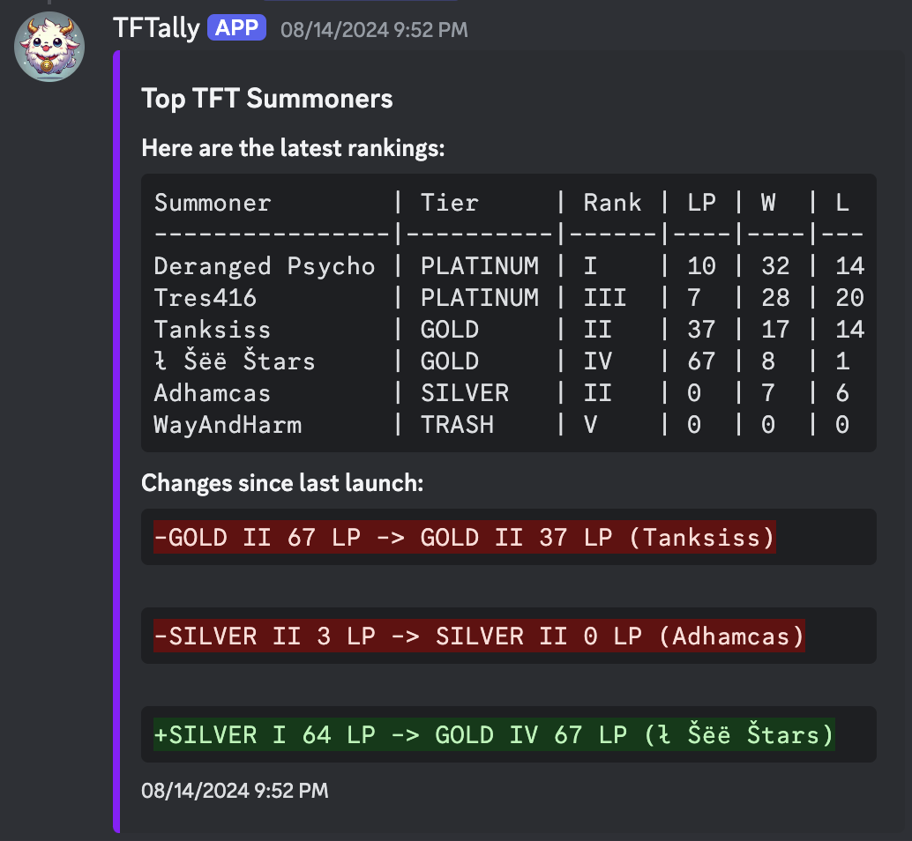
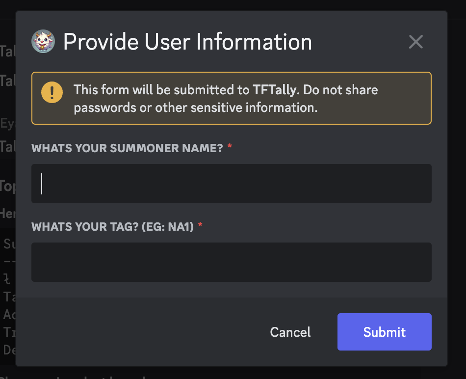

# TFTally - Discord Bot for TFT Leaderboard Tracking

TFTally is a Discord Bot built using [discord.js](https://discord.js.org) that
allows you to create a personal leaderboard for your channel to compare whos
better!

## Getting Started

### [Install TFTally](https://discord.com/oauth2/authorize?client_id=1270019786415407255&permissions=0&integration_type=0&scope=bot+applications.commands) on your discord server

## Features

- **TFT Leaderboard Command**: Retrieves and displays the current TFT
  leaderboard rankings.
- **Database Integration**: Utilizes MariaDB to store individual leaderboards
  based off your Discord guild.
- **Formatted Output**: Presents summoner statistics in a clear, sorted and
  readable table format.

## Commands

- **/tft_leaderboard**: Fetches and displays the TFT leaderboard, providing updates since the last call.

  

- **/addaccount**: Opens a modal allowing you to insert summoners into the guild’s leaderboard, given the summoner name and respective tag (e.g., Tanksiss#NA1).

  

## Stack

- **Node.js**: JavaScript runtime used for building the bot.
- **Discord.js**: Library for interacting with the Discord API and managing bot functionality.
- **MariaDB/MySQL**: Relational database used for scalable data management.
- **SQLite**: Initially used for data storage before migrating to MariaDB/MySQL.
- **Jest**: Testing framework for writing and running unit tests.
